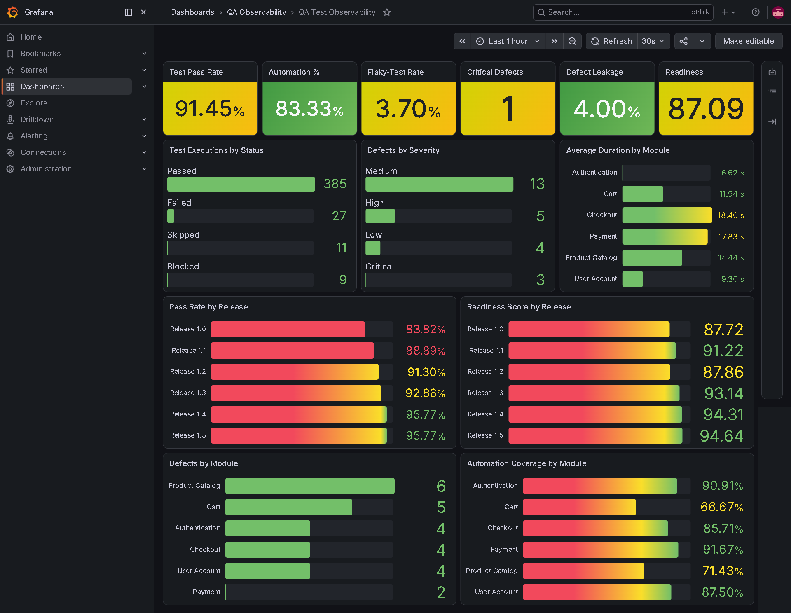

# Grafana QA Observability

## Overview

This implementation provides operational visibility into synthetic QA metrics through a Python Prometheus exporter, Prometheus time-series storage, and a provisioned Grafana dashboard.

The observability pipeline is:

```text
Synthetic QA CSV Data
        |
        v
Python QA Metrics Exporter
        |
        v
Prometheus
        |
        v
Grafana
```

The stack runs locally through Docker Compose and demonstrates QA metric engineering, Prometheus instrumentation, automated metric validation, containerization, dashboard provisioning, and operational health verification.

## Dashboard Preview



## Architecture

### Synthetic QA Data

The exporter reads the deterministic datasets stored under:

```text
data/raw/
```

The source files are:

```text
data/raw/releases.csv
data/raw/test_cases.csv
data/raw/test_executions.csv
data/raw/defects.csv
```

These datasets represent releases, reusable test cases, execution results, defects, automation state, flaky executions, and release-quality indicators.

### Python Metrics Exporter

The exporter loads and validates the CSV files, calculates QA metrics, and exposes them in Prometheus format.

```text
scripts/qa_metrics_exporter.py
```

The exporter:

- Verifies that all required dataset files exist
- Validates required columns before calculating metrics
- Converts supported CSV boolean values safely
- Calculates overall QA metrics
- Calculates release-level QA metrics
- Calculates module-level defect, automation, and duration metrics
- Exposes metrics through an HTTP endpoint
- Refreshes metrics from the mounted CSV directory every 30 seconds
- Publishes exporter refresh health and timestamp metrics
- Prevents division-by-zero failures
- Runs as a non-root user inside its container

Exporter endpoint:

```text
http://localhost:8000/metrics
```

### Prometheus

Prometheus scrapes the Python exporter and stores the metric samples as time-series data.

Configuration file:

```text
config/prometheus/prometheus.yml
```

Configured scrape target:

```text
http://qa-metrics-exporter:8000/metrics
```

Configured intervals:

| Setting | Value |
|---|---:|
| Scrape interval | 15 seconds |
| Scrape timeout | 10 seconds |
| Evaluation interval | 15 seconds |

Prometheus interface:

```text
http://localhost:9090
```

### Grafana

Grafana queries Prometheus and presents the QA metrics through a provisioned dashboard.

Grafana interface:

```text
http://localhost:3000
```

Dashboard URL:

```text
http://localhost:3000/d/qa-test-observability
```

Dashboard title:

```text
QA Test Observability
```

Dashboard UID:

```text
qa-test-observability
```

## Runtime Versions

The container versions are pinned in `compose.yaml` and `Dockerfile.exporter`.

| Component | Version |
|---|---|
| Python exporter image | `python:3.14-slim` |
| Prometheus | `prom/prometheus:v3.13.1` |
| Grafana | `grafana/grafana:13.1.1` |

Pinned versions make local execution and portfolio review more reproducible.

## Implementation Files

### Metrics Exporter

```text
scripts/qa_metrics_exporter.py
```

### Exporter Tests

```text
tests/test_qa_metrics_exporter.py
```

### Exporter Docker Image

```text
Dockerfile.exporter
```

### Docker Compose Stack

```text
compose.yaml
```

### Prometheus Configuration

```text
config/prometheus/prometheus.yml
```

### Grafana Datasource Provisioning

```text
config/grafana/provisioning/datasources/prometheus.yml
```

### Grafana Dashboard Provisioning

```text
config/grafana/provisioning/dashboards/dashboard.yml
```

### Grafana Dashboard JSON

```text
dashboards/grafana/qa-observability-dashboard.json
```

### Dashboard Screenshot

```text
exports/grafana/qa-test-observability-dashboard.png
```

### Environment Template

```text
.env.example
```

## Grafana Provisioning

Grafana configuration is stored in the repository so the datasource and dashboard can be created automatically during container startup.

### Prometheus Datasource

The provisioned datasource uses:

```text
Name: Prometheus
UID: prometheus
Type: prometheus
URL: http://prometheus:9090
Default datasource: true
Editable: false
```

Configuration file:

```text
config/grafana/provisioning/datasources/prometheus.yml
```

### Dashboard Provider

The dashboard provider loads JSON dashboards from:

```text
/var/lib/grafana/dashboards
```

The local dashboard directory is mounted into that container path through Docker Compose.

Configuration file:

```text
config/grafana/provisioning/dashboards/dashboard.yml
```

The dashboard is provisioned as non-editable so the version-controlled JSON remains the source of truth.

## Dashboard Panels

The dashboard contains 13 provisioned panels.

### QA Health Summary

1. Test Pass Rate
2. Automation %
3. Flaky-Test Rate
4. Critical Defects
5. Defect Leakage
6. Readiness

### Execution and Defect Analysis

7. Test Executions by Status
8. Defects by Severity
9. Defects by Module

### Release Analysis

10. Pass Rate by Release
11. Readiness Score by Release

### Efficiency and Automation

12. Average Duration by Module
13. Automation Coverage by Module

Percentage panels use fixed zero-to-one scales and display percentage units.

Release-readiness panels use fixed zero-to-one-hundred scales.

## Exported Prometheus Metrics

### Exporter Health

```text
qa_exporter_last_refresh_success
qa_exporter_last_refresh_timestamp_seconds
```

### Test Execution

```text
qa_test_executions_total
qa_test_pass_rate_ratio
qa_test_failure_rate_ratio
qa_test_duration_seconds_average
qa_test_executions_by_release_total
qa_test_pass_rate_by_release_ratio
qa_test_failure_rate_by_release_ratio
```

### Automation and Stability

```text
qa_automation_eligible_test_cases
qa_automated_test_cases
qa_automation_coverage_ratio
qa_automation_gap_test_cases
qa_flaky_test_executions
qa_flaky_test_rate_ratio
qa_flaky_test_rate_by_release_ratio
qa_automation_test_cases_by_module
qa_automation_coverage_by_module_ratio
```

### Defects

```text
qa_defects_total
qa_open_critical_defects
qa_production_defects
qa_defect_leakage_ratio
qa_reopened_defects
qa_defect_reopen_rate_ratio
qa_defects_by_severity_total
qa_defects_by_status_total
qa_defects_by_module_total
qa_defects_by_detection_phase_total
qa_open_critical_defects_by_release
qa_defect_leakage_by_release_ratio
```

### Release Readiness

```text
qa_release_readiness_score
qa_release_readiness_by_release_score
```

## Metric Definitions

### Test Pass Rate

```text
Passed non-skipped executions / Total non-skipped executions
```

### Test Failure Rate

```text
Failed executions / Total non-skipped executions
```

### Automation Coverage

```text
Automated test cases / Automation-eligible test cases
```

### Flaky-Test Rate

```text
Flaky automated executions / Automated executions
```

### Defect Leakage

```text
Production defects / Confirmed defects
```

### Defect Reopen Rate

```text
Reopened defects / Resolved or closed defects
```

### Release-Readiness Score

The portfolio-defined readiness score has a maximum value of 100.

| Component | Weight |
|---|---:|
| Test pass rate | 40 |
| Automation coverage | 20 |
| Test stability | 15 |
| Defect leakage control | 15 |
| Open critical defects | 10 |

The readiness score is a documented project assumption. It does not replace a production release decision, stakeholder approval, business-risk review, or complete test-coverage assessment.

## Verified Metric Values

The exporter, Prometheus queries, Grafana dashboard, and Power BI report display consistent results from the current deterministic dataset.

| Metric | Verified result |
|---|---:|
| Total test executions | 432 |
| Test pass rate | 91.45% |
| Automation coverage | 83.33% |
| Flaky-test rate | 3.70% |
| Total defects | 25 |
| Open critical defects | 1 |
| Defect leakage | 4.00% |
| Release-readiness score | 87.09 |

## Automated Test Coverage

The complete project test suite is organized across:

```text
tests/test_data_generation.py
tests/test_qa_data_validation.py
tests/test_qa_metrics_exporter.py
```

The tests validate:

- Synthetic dataset sizes and identifier uniqueness
- Dataset relationships and execution chronology
- Automation eligibility and supported execution values
- Missing schema and relationship-column handling
- Unknown foreign-key reference reporting
- Safe ratio calculation and division-by-zero handling
- Release-readiness scoring and critical-defect penalties
- Traceability between source data and calculated metrics
- Release-level metric creation
- Required CSV file loading
- Missing dataset and required-column handling
- Prometheus metric publication

Verified test result:

```text
27 passed
```

## Prerequisites

Install and start:

- Git
- Python 3
- Docker Desktop
- Docker Compose
- PowerShell

Docker Desktop must use the Linux container engine.

## Environment Configuration

The committed environment template is:

```text
.env.example
```

Create the local environment file from the repository root:

```powershell
Copy-Item ".env.example" ".env"
```

Open the local file:

```powershell
code ".env"
```

Set a private Grafana administrator password:

```text
GRAFANA_ADMIN_USER=qaadmin
GRAFANA_ADMIN_PASSWORD=replace-with-a-strong-local-password
```

Replace the example password before starting the stack.

The local `.env` file is ignored by Git and must not be committed.

Verify that Git ignores it:

```powershell
git check-ignore -v .env
```

## Local Execution

Run all commands from the repository root.

### Install Python Dependencies

Activate the project virtual environment:

```powershell
.\.venv\Scripts\Activate.ps1
```

Install the pinned Python dependencies:

```powershell
python -m pip install -r requirements.txt
```

### Validate the Python Exporter

```powershell
.\.venv\Scripts\python.exe -m py_compile scripts\qa_metrics_exporter.py
```

A successful syntax check produces no output.

### Run Automated Tests

```powershell
.\.venv\Scripts\python.exe -m pytest
```

Verified result:

```text
27 passed
```

### Validate Docker Compose

```powershell
docker compose config --quiet
```

A successful validation produces no output.

### Build the Exporter Image

```powershell
docker build --file Dockerfile.exporter --tag qa-metrics-exporter:local .
```

### Start the Complete Stack

```powershell
docker compose up --detach --build
```

This starts:

```text
qa-metrics-exporter
qa-prometheus
qa-grafana
```

### Check Container Status

```powershell
docker compose ps
```

Expected state:

- `qa-metrics-exporter` is running and healthy
- `qa-prometheus` is running
- `qa-grafana` is running

### View Container Logs

```powershell
docker compose logs --no-color --tail 50
```

Healthy startup logs should show:

- Exporter started successfully
- Exporter metrics refreshed successfully
- Prometheus configuration loaded successfully
- Prometheus server ready to receive requests
- Grafana modules healthy
- Grafana HTTP server listening on port 3000

### Open Grafana

```powershell
Start-Process "http://localhost:3000"
```

Use:

```text
Username: value from GRAFANA_ADMIN_USER
Password: private value from GRAFANA_ADMIN_PASSWORD
```

### Open the Dashboard Directly

```powershell
Start-Process "http://localhost:3000/d/qa-test-observability"
```

### Open Prometheus

```powershell
Start-Process "http://localhost:9090"
```

### Open the Exporter Endpoint

```powershell
Start-Process "http://localhost:8000/metrics"
```

## Operational Validation

### Exporter Endpoint Health

```powershell
(Invoke-WebRequest "http://localhost:8000/metrics").StatusCode
```

Verified result:

```text
200
```

### Published Metric Values

```powershell
(Invoke-WebRequest "http://localhost:8000/metrics").Content -split "`n" |
    Select-String "^qa_(test_pass_rate_ratio|automation_coverage_ratio|flaky_test_rate_ratio|defect_leakage_ratio|release_readiness_score) "
```

Verified output includes:

```text
qa_test_pass_rate_ratio 0.9144893111638955
qa_automation_coverage_ratio 0.8333333333333334
qa_flaky_test_rate_ratio 0.037037037037037035
qa_defect_leakage_ratio 0.04
qa_release_readiness_score 87.09
```

### Prometheus Target Health

```powershell
$response = Invoke-RestMethod "http://localhost:9090/api/v1/targets"

$response.data.activeTargets |
    Select-Object @{
        Name = "Job"
        Expression = { $_.labels.job }
    }, Health, ScrapeUrl, LastError
```

Verified target:

```text
Job: qa-metrics-exporter
Health: up
Scrape URL: http://qa-metrics-exporter:8000/metrics
Last error: none
```

### Grafana Health

```powershell
Invoke-RestMethod "http://localhost:3000/api/health"
```

Verified result:

```text
database: ok
version: 13.1.1
```

## Data Refresh Behaviour

The exporter rereads the mounted CSV files every 30 seconds.

Prometheus scrapes the exporter every 15 seconds.

Grafana queries Prometheus and does not read the CSV files directly.

The current source dataset is deterministic. Dashboard values remain stable until the CSV data changes or is regenerated.

After updating dashboard JSON, Grafana normally reloads the provisioned dashboard automatically. A Grafana container restart may be used when an updated provisioned dashboard is not immediately visible.

```powershell
docker compose restart grafana
```

## Stopping the Stack

Stop and remove containers and the project network:

```powershell
docker compose down
```

This preserves the named Grafana and Prometheus volumes.

## Removing Stored Data

The following command also removes the named Grafana and Prometheus volumes:

```powershell
docker compose down --volumes
```

This is destructive because it removes locally stored Grafana and Prometheus data. Use it only when resetting the environment is intentional.

## Troubleshooting

### Grafana Does Not Start

Check the container state:

```powershell
docker compose ps
```

Review Grafana logs:

```powershell
docker compose logs --no-color grafana
```

Confirm that `.env` exists and contains a non-placeholder password:

```powershell
Test-Path ".env"
```

Do not print or share the `.env` contents.

### Port 3000 Is Already in Use

Find the process using port 3000:

```powershell
Get-NetTCPConnection -LocalPort 3000 -ErrorAction SilentlyContinue |
    Select-Object LocalAddress, LocalPort, State, OwningProcess
```

Identify the process:

```powershell
Get-Process -Id <PROCESS_ID>
```

Stop the conflicting application safely or change the Grafana host port in `compose.yaml`.

### Port 8000 Is Already in Use

Check port 8000:

```powershell
Get-NetTCPConnection -LocalPort 8000 -ErrorAction SilentlyContinue |
    Select-Object LocalAddress, LocalPort, State, OwningProcess
```

A manually started exporter or background PowerShell job may still be using the port.

List PowerShell jobs:

```powershell
Get-Job
```

Stop a confirmed exporter job:

```powershell
Stop-Job -Id <JOB_ID>
Remove-Job -Id <JOB_ID>
```

### Port 9090 Is Already in Use

Check port 9090:

```powershell
Get-NetTCPConnection -LocalPort 9090 -ErrorAction SilentlyContinue |
    Select-Object LocalAddress, LocalPort, State, OwningProcess
```

Stop the conflicting Prometheus process safely or change the host port mapping in `compose.yaml`.

### Exporter Container Is Unhealthy

Check the exporter logs:

```powershell
docker compose logs --no-color qa-metrics-exporter
```

Verify the endpoint from the host:

```powershell
Invoke-WebRequest "http://localhost:8000/metrics"
```

Confirm that all source files exist:

```powershell
Get-ChildItem "data\raw"
```

Required files:

```text
releases.csv
test_cases.csv
test_executions.csv
defects.csv
```

Run the data validator:

```powershell
.\.venv\Scripts\python.exe scripts\validate_qa_data.py
```

### Prometheus Target Shows Down

Check target health:

```powershell
$response = Invoke-RestMethod "http://localhost:9090/api/v1/targets"
$response.data.activeTargets
```

Verify that the exporter container is healthy:

```powershell
docker compose ps
```

Check the Prometheus and exporter logs:

```powershell
docker compose logs --no-color prometheus qa-metrics-exporter
```

Confirm that the configured target is:

```text
qa-metrics-exporter:8000
```

Do not use `localhost:8000` inside the Prometheus container because `localhost` would refer to the Prometheus container itself.

### Grafana Dashboard Does Not Display Data

Verify that Prometheus is the default datasource.

Check the datasource provisioning file:

```text
config/grafana/provisioning/datasources/prometheus.yml
```

Verify that the Prometheus target is healthy.

Restart Grafana after provisioning changes:

```powershell
docker compose restart grafana
```

Refresh the browser using:

```text
Ctrl + F5
```

### Dashboard JSON Changes Are Not Visible

Validate the local dashboard JSON:

```powershell
Get-Content "dashboards\grafana\qa-observability-dashboard.json" -Raw |
    ConvertFrom-Json |
    Select-Object title, uid
```

Restart Grafana:

```powershell
docker compose restart grafana
```

Wait several seconds and refresh the browser.

The expected UID is:

```text
qa-test-observability
```

### Docker Compose Configuration Fails

Run:

```powershell
docker compose config --quiet
```

Common causes include:

- Missing `.env`
- Placeholder or empty Grafana password
- Incorrect YAML indentation
- Missing mounted files
- Invalid image name or version
- Port conflicts

### Grafana Login Fails

Confirm that the username matches:

```text
GRAFANA_ADMIN_USER
```

Confirm that the password comes from the local `.env` file.

Do not share the password.

When Grafana has already initialized its named volume, changing `.env` may not automatically replace the existing administrator password. Resetting the Grafana volume is destructive and should only be performed intentionally.

## Security

- Only synthetic QA data is used.
- Grafana credentials are stored in the ignored local `.env` file.
- `.env.example` contains placeholders only.
- Credentials, tokens, API keys, and private URLs must not be committed.
- The exporter runs as a non-root container user.
- The Grafana datasource and dashboard are provisioned from version-controlled files.
- No production systems or confidential datasets are connected.

## Limitations

- The source data is synthetic.
- The current metrics represent generated QA history rather than a production CI/CD pipeline.
- The exporter reads CSV files instead of a test-management, defect-tracking, or CI/CD API.
- The readiness formula uses project-defined weights.
- No Grafana alert rules are currently configured.
- No email, Slack, Microsoft Teams, or PagerDuty notifications are configured.
- Prometheus history is retained only while the local named volume remains available.
- The generated dataset remains unchanged until the source CSV files are modified or regenerated.
- Local ports must be available for Grafana, Prometheus, and the exporter.

## Planned Improvements

- Add Grafana alert rules for unhealthy QA thresholds
- Add alert notification integration
- Publish metrics from an automated test pipeline
- Add environment, browser, and module dashboard filters
- Add CI validation for Docker Compose and dashboard JSON
- Add container vulnerability scanning
- Add exporter integration tests against a running HTTP endpoint
- Add documented recovery and volume-backup procedures

## Portfolio Value

This implementation demonstrates:

- QA metric definition and calculation
- Traceability from source data to dashboard values
- Python Prometheus instrumentation
- Automated metric validation with pytest
- Defensive data and schema validation
- Docker image creation
- Non-root container execution
- Docker Compose orchestration
- Prometheus scrape configuration
- Grafana datasource provisioning
- Grafana dashboard-as-code
- Dashboard scale and presentation design
- Operational endpoint and container verification
- Secure local credential handling
- Technical documentation and troubleshooting
